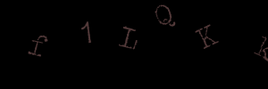
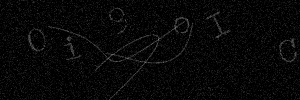

# Captcha

Captcha is a Java library used to generate Captcha Images and GIFs.

## Samples
Captcha GIF using just text:  


Captcha GIF using text and gaussian:  


Captcha GIF using text, gaussian and strokes:  


## Code example

For examples check out: [Captcha Tests](src/test/java/com/arkoisystems/captcha)

## Installation
### Gradle

When using gradle you just need to add the maven repository to the end of the 
repositories:
```groovy
allprojects {
    repositories {
        ...
        maven { url 'https://jitpack.io' }
    }
}
```

Then you can just add the dependency:
```groovy
dependencies {
    implementation 'com.github.Excse:captcha:master-SNAPSHOT'
}
```

For other installations visit: https://jitpack.io/#Excse/captcha/master-SNAPSHOT

## Contributing
Pull requests are welcome. For major changes, please open an issue first to discuss what you would like to change.

Please make sure to update tests as appropriate.

## License
[MIT](https://choosealicense.com/licenses/mit/)
